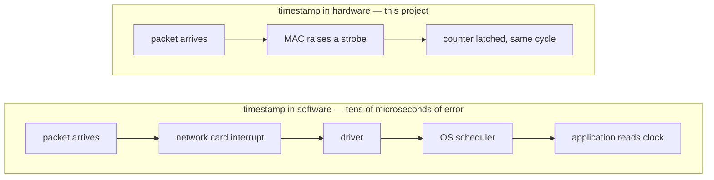
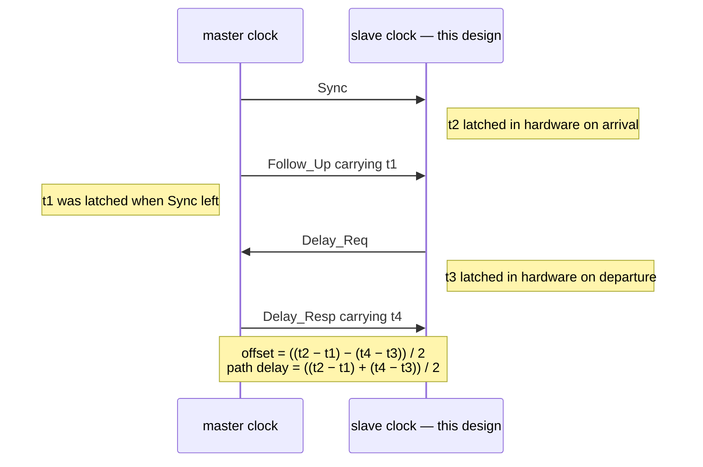
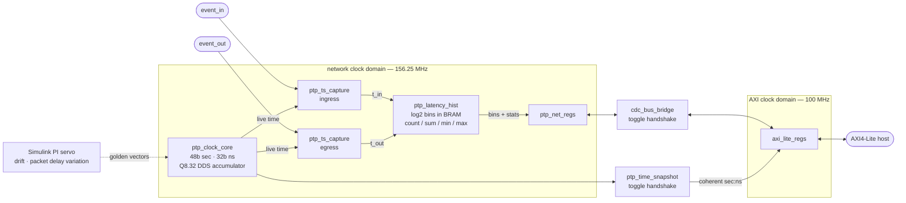
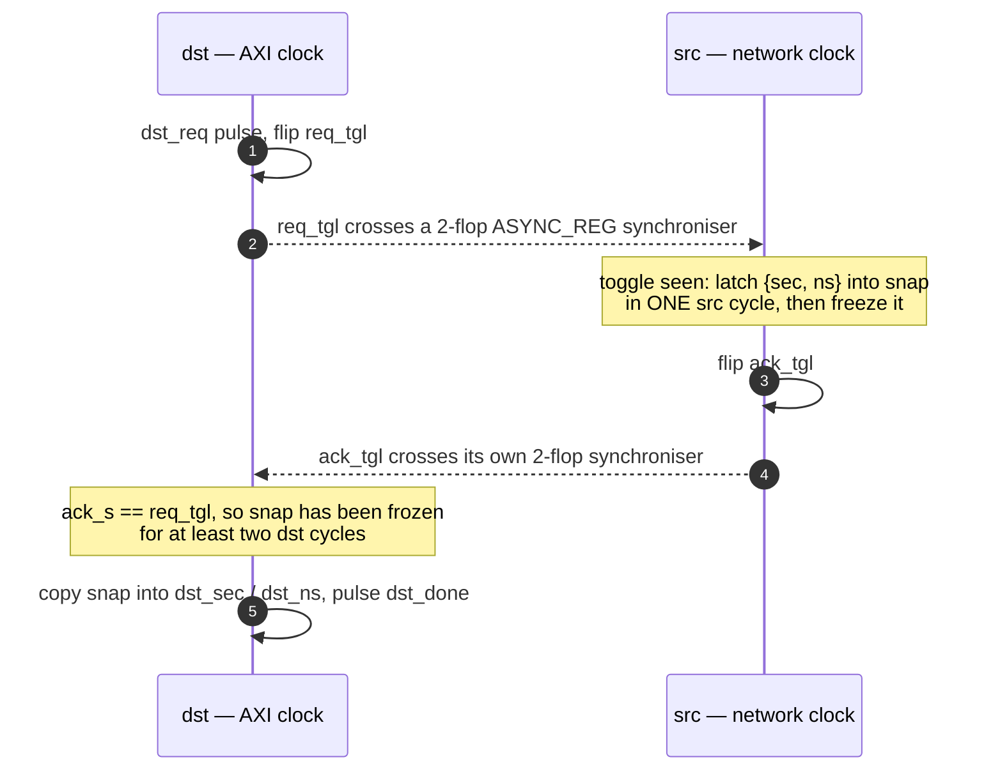
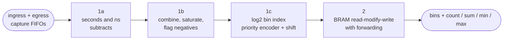
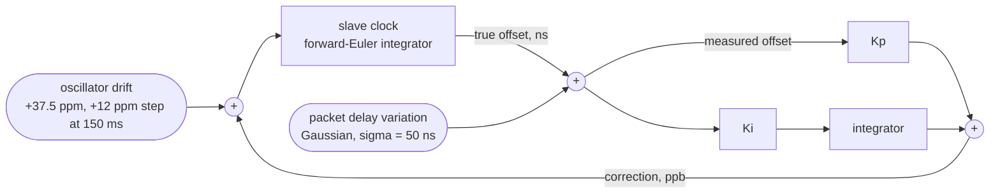

# PTP / IEEE-1588 Hardware Timestamping Unit

A hardware timestamping and latency-measurement unit in SystemVerilog: a 1588 clock core with DDS-based ppb frequency slewing, a handshake-synchronised 64-bit time snapshot across asynchronous clock domains, event timestamp capture, a log₂-binned latency histogram engine readable over AXI-Lite, and a Simulink model of the PI servo that disciplines the clock — with the RTL diffed against golden vectors exported from that model.

Every block exists because the one next to it needs it: the clock has to be read across domains, the timestamps have to be turned into a measurement, and the servo has to be modeled to know the clock converges.

**Headline results**

- Meets the 156.25 MHz 10 Gigabit Ethernet clock on a Kintex-7 (+0.877 ns slack) and on a −3 Zynq-7020 (+0.242 ns), in 1281 LUTs and half a block RAM
- Zero critical findings from Vivado's clock-domain-crossing checker, on a crossing where the textbook answer, Gray coding, does not apply
- 12 000 cross-domain snapshots with no torn reads, while a naive double-flop tears 12–22 % of reads in the same testbench
- RTL clock state bit-identical to a Simulink-derived model across 300 servo steps and 46.9 million cycles
- Timing closure took four iterations, one of which was spent discovering that Vivado had optimised the fix away

---

## What problem this solves

Networked machines disagree about what time it is. Their crystals drift apart by tens of
parts per million, which is milliseconds of error per minute, and a packet's travel time
varies from one message to the next. **IEEE 1588**, usually called **PTP** for Precision
Time Protocol, is the standard that fixes this: a master announces its time, each slave
measures its own offset and the path delay, and steers its clock until the two agree.

The protocol's accuracy is decided almost entirely by *where the timestamp is taken*.



A timestamp taken by software inherits every queue, interrupt and scheduling delay between
the wire and the application, and those vary unpredictably. A timestamp taken in the
network interface's own clock domain, the instant the packet's first bit crosses a fixed
point, does not. That hardware unit is what this project builds.

Sub-microsecond synchronisation is not achievable without it. This is why PTP-capable
network cards, switches and FPGAs all carry a hardware timestamping unit, and why this
block is standard content in any design that touches precision timing.

## How PTP uses these timestamps

Four timestamps per exchange, two of which this hardware produces on the slave side:



The servo then turns that offset into a correction. A large offset is applied as a single
jump; small ones are corrected by *slewing* the clock's rate, so time stays monotonic and
never jumps backwards. Both mechanisms are implemented here, and the servo that drives
them is modelled in Simulink and diffed against the hardware.

## Where this is used

| Domain | What it needs timestamps for | Typical requirement |
|---|---|---|
| **Trading systems** | Proving when an order was received and sent; measuring tick-to-trade latency. Regulations such as MiFID II RTS 25 require timestamps traceable to UTC within 100 µs, and firms run far tighter internally | microseconds down to nanoseconds |
| **Mobile networks** | 5G fronthaul carries radio data over Ethernet; radios must agree on time or their transmissions interfere | sub-microsecond, often under 130 ns |
| **Industrial control** | Time-Sensitive Networking schedules traffic into fixed windows so a robot's control loop cannot be delayed by other traffic | sub-microsecond |
| **Broadcast** | SMPTE ST 2110 sends video, audio and metadata as separate streams that must be recombined in exact alignment | sub-microsecond |
| **Power grids** | Substation equipment compares waveform phase between distant sites to locate faults | around 1 µs |
| **Test and measurement** | Distributed instruments sampling a shared event on one timebase | nanoseconds |

## A worked example

Suppose this unit sits in a market-data feed handler, the same kind as the author's
[fpga-crypto-feed-handler](https://github.com/srikarvela/fpga-crypto-feed-handler) project.

- The MAC raises a strobe when a market-data packet's first byte arrives. The ingress
  capture unit latches PTP time: **t_in**.
- The pipeline parses the packet, updates the order book, and decides to send an order.
- The MAC raises a second strobe as that order leaves. The egress capture latches
  **t_out**.
- The histogram engine computes `t_out − t_in` and drops it into a bin, in hardware, at
  line rate.

Software then reads one register for the sample count, another for the running sum, and
128 bin counters, and gets the full latency distribution: not just the average, but the
shape of the tail. A mean of 300 ns hides the fact that one packet in ten thousand took
9 µs, and the tail is exactly what a trading system cares about. Because binning is
logarithmic, a handful of counters covers everything from 1 nanosecond to 4 seconds at
25 % resolution, so nothing needs to be configured in advance to catch an outlier.

The same arrangement measures switch latency, processing jitter through a DSP chain, or
the round trip of a control loop. Wherever two strobes can be placed, this measures the
distribution between them.


## 🚧 Project Status

| Step | Block | Status |
|---|---|---|
| 1 | IEEE-1588 clock core (`ptp_clock_core`) | ✔ RTL + self-checking TB |
| 2 | Timestamp capture unit (`ptp_ts_capture`, `sync_fifo`) | ✔ RTL + TB |
| 3 | Cross-domain time snapshot (`ptp_time_snapshot`, handshake CDC) | ✔ RTL + two-clock TB + XDC |
| 4 | Latency histogram engine + AXI-Lite top (`ptp_latency_hist`, `cdc_bus_bridge`, `ptp_net_regs`, `axi_lite_regs`, `ptp_tsu_top`) | ✔ RTL + unit TB + system TB |
| 5 | Simulink PI servo model + bit-exact golden vectors + RTL diff (`matlab/`, `tb_servo_golden`, `python/servo_diff.py`) | ✔ |
| — | Vivado OOC synthesis: Fmax, LUT/FF/BRAM, timing | ✔ reports in [synth/reports](synth/reports) |

Simulation: Icarus Verilog 12 (`make sim`). Synthesis: Vivado out-of-context (`make synth`, Linux/Windows). Servo model: MATLAB R2026a / Simulink (`make matlab`).

---

## 📐 Architecture



Two asynchronous clocks. Everything that touches time lives in the network domain;
the AXI domain reaches it only through the two handshakes.

---

## 1. Clock core — `rtl/ptp_clock_core.sv`

Time is held as the PTP `{seconds[47:0], nanoseconds[31:0]}` pair. Each network-clock cycle the clock advances by an increment in **Q8.32 fixed-point nanoseconds**:

```
incr_eff = nom_incr + freq_adj
```

`nom_incr` is the nominal period (6.4 ns at 156.25 MHz → `0x6_6666_6666`). `freq_adj` is a signed addend written by the servo. The 32 fractional bits make this a DDS-style phase accumulator: each cycle only an integer number of ns is added, but the fractional carry lands on average `frac(incr_eff)` times per cycle, so the long-run rate is exact and can be slewed with sub-ppb resolution:

| quantity | value at 6.4 ns |
|---|---|
| 1 LSB of `freq_adj` | 2⁻³² ns/cycle = **0.036 ppb** |
| 1 ppb | 27.49 LSB |
| 100 ppm | 2 748 779 LSB |

- **Phase adjust**: one-shot signed `(adj_sec, adj_ns)` added in the same cycle as the normal increment; ns is renormalised into `[0, 1e9)` with a single ±1e9 correction (requires `|adj_ns| < 1e9`).
- **Absolute load**: `set_valid` loads `(set_sec, set_ns)` and clears the fractional accumulator.
- **pps**: one-cycle pulse whenever the ns field carries into seconds.
- **Critical path**: written the obvious way, the fraction accumulator, nanosecond add, compare against 1e9 and seconds add form one 148-bit ripple, and that cost the design 4.2 ns of slack on the first synthesis run. The arithmetic is now speculative: every add runs in parallel from the registers and multiplexers pick the result. See [section 6](#6-synthesis-results) for how that unfolded.

### Verification — `tb/tb_ptp_clock_core.sv`

The DUT keeps split `{sec, ns, frac}` fields with carry/borrow normalisation. The testbench keeps time as **one flat 96-bit number** `total = (sec·1e9 + ns)·2³² + frac`, advances it with the same stimulus, and compares `total / 1e9`, `total % 1e9` and `total[31:0]` against the DUT **every cycle**. The two formulations share no code, so agreement is a real check of the normalisation logic.

Directed tests on top of the per-cycle compare:

| test | what it proves |
|---|---|
| T1 nominal rate | 10⁶ cycles → 6 400 000 ns within 10⁻⁴ ns |
| T2 +100 ppm slew | elapsed time scales to 6 400 640 ns |
| T3 −1 ppb slew | a 27-LSB adjust resolves as −6.4 ps over 10⁶ cycles |
| T4 rollover | second boundary crossed, exactly one `pps` pulse |
| T5 / T6 offsets | +ns carries into seconds, −ns and −sec borrow correctly |
| T7 random | 10⁵ cycles of random freq/offset/set, ~3.1 M field compares |

```bash
make sim-ptp_clock_core           # add WAVES=1 for build/tb_ptp_clock_core.vcd
```

---

## 2. Timestamp capture — `rtl/ptp_ts_capture.sv`

On the rising edge of an event strobe the current `{sec, ns}` is latched and pushed into a synchronous FIFO (`rtl/sync_fifo.sv`, depth 2ⁿ, drop-on-full). A downstream consumer, the latency histogram or software, pops timestamps in order.

- **Resolution is one network-clock period: 6.4 ns at 156.25 MHz.** The fractional accumulator bits are not captured; they describe the clock's rate, not where the event sits inside the period. Sub-period interpolation needs a device-specific delay line or oversampled phase detector and is deliberately out of scope for a simulation-only design.
- **Event input**: `EVENT_SYNC_STAGES = 0` for a strobe already in the network clock domain (a MAC start-of-frame pulse); `≥ 2` passes an asynchronous strobe through that many `ASYNC_REG` flops first, adding a fixed latency that cancels in any `t_out − t_in`.
- **Overflow**: an event arriving while the FIFO is full is dropped and a saturating `drop_count` increments, so software can tell when the histogram is incomplete. Two capture units (ingress / egress) feed the histogram engine.

### Verification — `tb/tb_ptp_ts_capture.sv`

| test | what it proves |
|---|---|
| T1 random strobes + back-pressure | 1.5 k timestamps popped in order, each exactly equal to the time the clock held in the cycle the strobe was sampled |
| T2 overflow | 20 strobes with pops stalled → 16 kept, 4 dropped, the survivors are the *first* 16, `drop_clear` works |
| T3 async strobe | strobes from an unrelated 73 MHz clock through the 2-flop synchroniser land within 4 periods of the event, monotonic |

```bash
make sim-ptp_ts_capture
```

---

## 3. Cross-domain time snapshot — `rtl/ptp_time_snapshot.sv`

The counter lives in the network clock domain; the core / AXI domain has to read it coherently.

**Why the obvious answer is wrong.** You cannot double-flop an 80-bit bus: each bit has its own routing delay, so a destination edge that lands mid-transition samples some old bits and some new ones, and the word it reads never existed. Gray code fixes this for a counter that steps by exactly 1 (one bit changes per step), but a PTP clock advances by an arbitrary Q8.32 period every cycle and renormalises at 10⁹, so many bits change per step. Gray is off the table.

**What this does instead: request, latch, handshake, read.**



Only the two single-bit toggle flags are synchronised. The 80-bit bus crosses as a multi-cycle path whose source register is frozen while the destination samples it (the MCP formulation from Cummings' SNUG 2008 CDC paper). [synth/ptp_cdc.xdc](synth/ptp_cdc.xdc) carries the `set_false_path` on the toggles and a `set_max_delay -datapath_only` / `set_bus_skew` of one source period on the bus, which is the bound the handshake relies on.

### Verification — `tb/tb_ptp_time_snapshot.sv`

Two free-running clocks: the source at 6.4 ns driving a live clock core, and the destination swept through four regimes, each restarted at a random phase offset. For every snapshot the TB checks **coherence** (the 80-bit value exactly matches an entry in a ring of values the source clock actually held), **bracketing** (`t_req ≤ snapshot ≤ t_done`), **bounded latency**, and **monotonicity**.

The same bus also feeds `tb/naive_bus_sync.sv`, a plain per-bit double-flop with random wire skew of up to 3 ns per bit. Its output is sampled on every destination edge and checked against the same history ring.

| regime | dst period | snapshots | errors | naive double-flop torn reads |
|---|---|---|---|---|
| T1 dst slower | 10.00 ns | 2000 | 0 | 21.9 % |
| T2 dst faster | 4.00 ns | 2000 | 0 | 12.5 % |
| T3 dst near-equal | 6.41 ns | 4000 | 0 | 13.0 % |
| T4 dst near-equal | 6.39 ns | 4000 | 0 | 13.2 % |

The near-equal cases matter most: the edges sweep slowly through every relative phase, which is the regime that exposes races in a wrong design. The test only passes if the handshake has zero errors **and** the naive model actually tears, so the comparison can't silently degrade into a no-op.

```bash
make sim-ptp_time_snapshot
```

---

## 4. Latency histogram engine — `rtl/ptp_latency_hist.sv`

A hardware profiler for `Δ = t_out − t_in`. The n-th egress timestamp is paired with the n-th ingress timestamp (in-order pipeline assumption); a sample is taken whenever both capture FIFOs have data.

- **Delta**: `sec_diff·10⁹ + (out_ns − in_ns)`, exact for seconds differences up to 5 (a constant mux plus one 35-bit add), saturating at 2³²−1 ns beyond that; `t_out < t_in` goes to a separate negative counter and is not binned.
- **Binning**: dense HdrHistogram-style log₂ with 2 sub-bins per octave. Deltas below 8 ns index linearly; above that the bin is `4·msb + sub − 4` where `msb` comes from a priority encoder and `sub` is the two bits under it. Edges: 0…7, 8, 10, 12, 14, 16, 20, 24, 28, 32, 40, … ns, 25 % relative width, 124 bins up to 4.29 s. The priority encoder is nearly free in LUTs.
Pipeline, after timing closure forced the first stage apart:



- **Storage**: counters in a `ram_style = "block"` RAM, read-modify-write with one-deep forwarding so back-to-back samples into the same bin count correctly (and the RAM's read-during-write collision value is never used). The RAM is swept to zero out of reset, so no init file is needed.
- **Stats**: count, 64-bit sum, min, max, negative count. Mean is `sum / count` in software; there is no divider in hardware.
- **Host access**: a one-bin read port that steals the read cycle from the sample pipeline, and a clear that sweeps all bins and stats.

### System integration — `rtl/ptp_tsu_top.sv`

```
 network clock domain                                 AXI clock domain
 ───────────────────────────────                      ──────────────────────
 ptp_clock_core ─┬─▶ ptp_ts_capture (in)  ─┐          axi_lite_regs
                 ├─▶ ptp_ts_capture (out) ─┴▶ ptp_latency_hist   0x000-0x0FF local
                 │                                 │              0x100+  ──▶ cdc_bus_bridge ──▶ ptp_net_regs
                 └─▶ ptp_time_snapshot ◀───────────┼──────────────── CTRL.SNAP_REQ
                                                   └── bin read port / stats / control
```

Everything that touches the clock lives in the network domain behind `rtl/ptp_net_regs.sv`. The AXI-Lite slave (`rtl/axi_lite_regs.sv`) answers the ID / status / snapshot words itself and forwards every other access through `rtl/cdc_bus_bridge.sv`, which is the same two-phase toggle handshake as the time snapshot generalised to carry `{addr, wdata, we}` across and `rdata` back. One transaction is in flight at a time, and the payload registers are frozen while their toggle is in flight, so they cross as multi-cycle paths exactly like the snapshot bus. Full map: [docs/REGMAP.md](docs/REGMAP.md); Python conversions (ppb → `FREQ_ADJ`, bin index ↔ edges): [python/ptp_tsu.py](python/ptp_tsu.py).

### Verification

`tb/tb_ptp_latency_hist.sv` (unit) checks every bin and all five statistics against a behavioural reference: directed bin edges, 500 back-to-back samples into one bin (the forwarding hazard), 10 k random pairs including second-boundary crossings, negatives and saturation with host reads interleaved, and clear.

`tb/tb_ptp_tsu_top.sv` (system) drives the whole unit over AXI-Lite at 100 MHz against the 156.25 MHz network clock at random phase:

| test | what it proves |
|---|---|
| T1–T2 | ID/version; control registers written and read back through the bridge; SET loads the clock |
| T3 | 20 coherent snapshots over AXI, each bracketed by network-side time at request and completion |
| T4 | `FREQ_ADJ` = +100 ppm written over AXI: 1 ms measures 1 000 100.0 ns |
| T5 | `ADJ_NS` phase step of 1234 ns appears in the next snapshot |
| T6 | 2000 strobe pairs with random delays: `HIST_COUNT`, min, max, 64-bit sum and all 128 bins read over AXI match a reference built from the exact network-side timestamps |
| T7 | `HIST_CLEAR` zeroes bins and stats; drop counters are 0 |

```bash
make sim-ptp_latency_hist
make sim-ptp_tsu_top
```

---

## 5. Servo model and golden-vector diff — `matlab/`

The hardware above is only useful if a servo can discipline it. Step 5 models that servo, proves it converges, and proves the RTL clock behaves bit-for-bit like the model the servo was designed against.

**Simulink model** (`matlab/ptp_servo.slx`, generated by `build_servo_model.m`): a discrete PI loop at a 1 ms sync interval. The slave clock is a Forward-Euler integrator of the frequency error (oscillator drift minus correction), the measurement adds packet delay variation, and the PI output feeds back as a rate correction in ppb. Offsets are in ns and rates in ppb so the plant needs no scaling.



Loop shape (Control System Toolbox): `s² + Kp·s + Ki` with `Kp = 88`, `Ki = 3948` gives ωₙ = 62.8 rad/s (10 Hz), ζ = 0.70, 2 % settling 78 ms. The interval is scaled down from the 125 ms–1 s of real PTP so the RTL replay stays short; the loop is invariant in ωₙ·Ts.

**Bit-exact clock model** (`ptp_clock_init.m`, `ptp_clock_step.m`): the Q8.32 accumulator, the registered increment (the first cycle after a `FREQ_ADJ` write still uses the old increment), the one-shot phase step and the 10⁹ renormalisation, fast-forwarded N cycles per step in closed-form integer math. This is exact because tb_ptp_clock_core already proved the RTL's split arithmetic equals a flat accumulator.

**Golden vectors** (`gen_golden_vectors.m` → `matlab/vectors/servo_vectors.txt`): the same PI controller drives the bit-exact clock through a scenario: the slave starts 2.5 ms ahead (handled by a phase step, since it exceeds the 1 ms slew threshold), its oscillator runs +37.5 ppm fast, PDV is Gaussian with σ = 50 ns, and at 150 ms the drift jumps a further +12 ppm. Each of the 300 steps records the `FREQ_ADJ` word, any phase step, and the exact `{sec, ns, frac}` the clock must hold 156 250 cycles later.

**RTL replay** (`tb/tb_servo_golden.sv`): drives those commands into `ptp_clock_core` with the same cycle protocol and compares all 112 bits of clock state after every step. `python/servo_diff.py` re-checks the trace against the vectors and reports lock time and residuals.

| result | value |
|---|---|
| Simulink vs bit-exact model, 300 steps | max offset diff 0.0002 ns, max correction diff 0.026 ppb (< 1 `FREQ_ADJ` LSB) |
| RTL vs golden, 300 steps × 156 250 cycles (46.9 M cycles) | 0 mismatches, bit-exact |
| lock (\|offset\| < 100 ns) | from 47 ms; residual RMS 34 ns, peak 95 ns with 50 ns PDV |
| +12 ppm drift step at 150 ms | 123 ns peak excursion, back under 100 ns in 26 ms |
| final correction | 46 186 ppb toward 49 500 ppb of drift (integrator still converging at 0.3 s) |


```bash
make matlab         # build + simulate Simulink, export vectors and plots (MATLAB R2026a)
make golden-diff    # replay vectors in RTL (Icarus) and diff
```

The vectors are committed, so the RTL diff runs without MATLAB.

---

## 6. Synthesis results

Out-of-context synthesis, place and route in Vivado 2024.1, driven by
[synth/ooc_synth.tcl](synth/ooc_synth.tcl). Out of context means no I/O buffers and no
board: the numbers below are internal register-to-register timing, which is what a block
destined to sit inside a larger design should be judged on. Reports for every part are
committed under [synth/reports](synth/reports).

```bash
make synth                                     # default part, synth + place + route
vivado -mode batch -source ooc_synth.tcl -tclargs xc7k160tffg676-2 impl
```

### Results by device

The same RTL, synthesised and routed for three parts. Speed grade is the suffix: −1 is the
slowest silicon in the family, −3 the fastest.

| Part | Board / class | Post-route WNS | Fmax (net_clk) | 156.25 MHz | LUTs | FFs | BRAM |
|---|---|---|---|---|---|---|---|
| `xc7z020clg400-1` | PYNQ-Z2, entry-level Zynq | −1.701 ns | 123.4 MHz | ✗ | 1380 | 1451 | 0.5 |
| `xc7z020clg400-3` | same device, fastest grade | **+0.242 ns** | 162.4 MHz | ✓ | 1289 | 1451 | 0.5 |
| `xc7k160tffg676-2` | Kintex-7, mid-range | **+0.877 ns** | 181.1 MHz | ✓ | 1281 | 1451 | 0.5 |

**The design meets 156.25 MHz on a −3 Zynq-7020 and on a mid-range Kintex-7, and misses it
on a −1 Zynq-7020, closing there at 123 MHz.** That is the honest result and it is the
expected one: 156.25 MHz is the 10 Gigabit Ethernet datapath clock, and a design running at
that line rate would not be placed on the slowest speed grade of an entry-level part. The
PYNQ-Z2 figure is reported because it is the board this author already owns, not because
the design is meant to live there.

On the parts that close, the rest of the picture is comfortable:

| Metric | xc7k160tffg676-2 | Note |
|---|---|---|
| AXI clock slack | +6.272 ns of 10 ns | the register interface is nowhere near critical |
| Hold slack | +0.095 ns | positive on every path, both clocks |
| CDC slack, network to AXI | +5.331 ns | against the one-period bound the handshake needs |
| CDC slack, AXI to network | +5.395 ns | |
| `report_cdc` critical findings | 0 | Vivado's own CDC checker, across all three parts |
| Area | 1281 LUTs, 1451 FFs, 0.5 BRAM | 1.26 % of the device's LUTs, 0.72 % of its flip-flops |

The remaining critical path on the fast parts is the histogram's block RAM
read-modify-write loop: memory output, 32-bit increment, back to memory input, in one
cycle. Breaking that further would mean either registering the RAM output and deepening the
forwarding logic, or moving the bin counters into distributed RAM. Neither was needed to
close, so neither was done.

Vivado's CDC checker reporting zero critical findings is the result worth pointing at. It
is an independent check on the handshake design: the tool confirms every crossing is
synchronised and constrained, rather than taking the testbench's word for it.

### Timing closure on the PYNQ-Z2 part (xc7z020clg400-1)

The first run missed the 6.400 ns budget badly, and fixing it took four iterations. The
interesting part is that the tool fought back in the middle of it.

| Run | Change | Post-route WNS | Fmax | Critical path |
|---|---|---|---|---|
| 1 | baseline RTL | −4.192 ns | 94.4 MHz | clock core, fraction to seconds, 36 levels, 30 chained CARRY4 |
| 2 | speculative parallel adds in the clock core | −3.264 ns | 103.5 MHz | same path, 27 levels: Vivado had re-merged the adders |
| 3 | `DONT_TOUCH` on the speculative values | −3.007 ns | 106.3 MHz | histogram stage 1, 15 levels |
| 4 | histogram delta/bin split into three stages | −1.701 ns | 123.4 MHz | clock core again, 15 levels |

**Run 1.** Written the obvious way, the clock core is one 148-bit ripple: the 32-bit
fraction accumulator carries into the 34-bit nanosecond add, which feeds the compare
against 10⁹, which feeds the 48-bit seconds add. Thirty carry chains in series.

**Run 2.** Rewritten so every add runs in parallel from the registers and multiplexers
pick the answer: the nanosecond sum computed for both fraction carries, the compare
replaced by the sign bit of an already-corrected value, and all three seconds outcomes
precomputed. It barely helped, and the path report showed why: one chain still fed the
next. Vivado had spotted that the corrected value is just the sum minus 10⁹, and that the
three seconds values differ by one, treated them as common subexpressions, and rebuilt the
serial structure to save area.

**Run 3.** `DONT_TOUCH` on the six speculative values forbids that merge. The clock core
path disappeared and the bottleneck moved to the histogram, whose first stage was doing a
memory read, two wide subtracts, an add, a saturation compare, a priority encoder, a
barrel shift and a subtract between two registers.

**Run 4.** That stage became three: subtracts, then combine and saturate, then the log₂
bin index. Samples land in the same bins two cycles later, and the read-modify-write
hazard window is untouched because it sits between the last stage and the memory write.

Four runs took the entry-level part from 94.4 MHz to 123.4 MHz, a 31 % improvement, and
every one of these changes is behaviour-preserving. None of the testbenches were touched to
accommodate them: the clock core still matches its flat fixed-point reference on
all 3.1 million per-cycle comparisons, and the RTL still reproduces the Simulink golden
vectors bit-for-bit across 300 servo steps.

---

## Verification at a glance

Every testbench is self-checking and prints `TEST PASSED`; `make sim` runs all six and
fails the build if any does not.

| Testbench | What it proves | Scale |
|---|---|---|
| `tb_ptp_clock_core` | split `{sec, ns, frac}` arithmetic matches a flat 96-bit fixed-point model, cycle by cycle; rate, ppm and ppb slewing, rollover, phase steps | 3.1 M field comparisons |
| `tb_ptp_ts_capture` | every timestamp equals the time held when the strobe was sampled; overflow drops the newest, not the oldest; async strobes bounded | 2.1 k timestamps |
| `tb_ptp_time_snapshot` | no torn reads across four clock ratios at random phase, while a naive double-flop tears 12–22 % of reads in the same run | 12 k snapshots |
| `tb_ptp_latency_hist` | all 128 bins and five statistics match a behavioural model, including the same-bin forwarding hazard | 10 k random pairs |
| `tb_ptp_tsu_top` | the whole unit over AXI4-Lite at 100 MHz against a 156.25 MHz network clock | 2 k strobe pairs |
| `tb_servo_golden` | RTL clock state is bit-identical to the Simulink-derived model at every servo step | 300 steps, 46.9 M cycles |

Three independent checks back each other up: a reference model written differently from the
RTL, a golden model in a different language and tool, and Vivado's own CDC analysis.

## Running it

```bash
make sim                 # all six testbenches (Icarus Verilog)
make sim-ptp_clock_core  # one testbench; WAVES=1 also dumps a VCD
make matlab              # Simulink servo, golden vectors, convergence plots (MATLAB)
make golden-diff         # replay the vectors in RTL and diff them
make synth               # Vivado out-of-context synthesis + place and route
```

Golden vectors are committed, so `make golden-diff` needs no MATLAB licence. Synthesis
needs Vivado; everything else runs on the free tools.

## Scope and limitations

Stated plainly, because a project claiming timing accuracy should be clear about what it
has not demonstrated.

- **Simulation and synthesis only.** Nothing has run on an FPGA. Every number here comes
  from Icarus Verilog or from Vivado's static timing analysis, not from measurement.
- **Timestamp resolution is one clock period, 6.4 ns at 156.25 MHz.** Sub-nanosecond
  interpolation was deliberately left out: real implementations use a device-specific delay
  line or oversampled phase detection, and in a simulation-only project a "sub-nanosecond"
  claim could not be substantiated.
- **The histogram pairs timestamps in order**, the n-th egress with the n-th ingress. That
  suits an in-order pipeline. Out-of-order traffic would need a tag carried alongside.
- **No PTP protocol stack.** This is the hardware layer: the clock, the timestamps, the
  measurement and the register interface. Parsing PTP messages and running the state
  machine is software's job, and the servo is modelled rather than implemented in RTL.
- **The servo runs at a 1 ms sync interval**, faster than the 125 ms to 1 s of real
  deployments, so the RTL replay fits in a reasonable simulation. The loop is scale
  invariant in the product of natural frequency and sample period.

---

## Repository layout

```
rtl/      SystemVerilog RTL (one module per file)
tb/       Icarus testbenches, tb_<module>.sv, self-checking (prints TEST PASSED)
synth/    Vivado OOC synthesis script, constraints, and committed reports
matlab/   Simulink servo model (generated), bit-exact clock model, golden-vector export
python/   register helpers, golden-vector diff
docs/     register map, design notes
```

## License

MIT — see [LICENSE](LICENSE).
