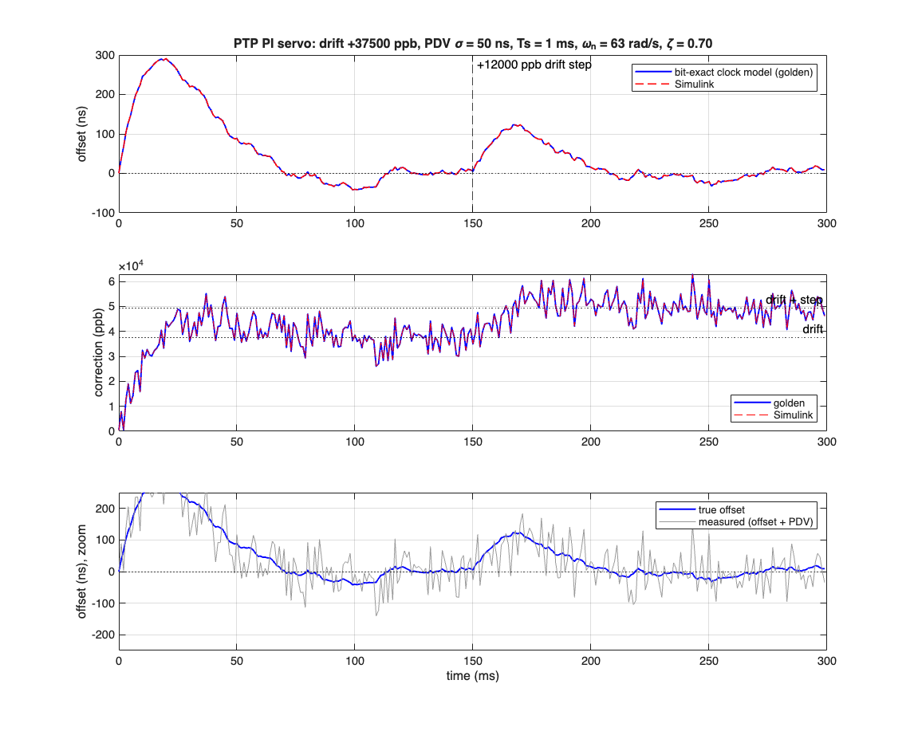

# PTP / IEEE-1588 Hardware Timestamping Unit

A hardware timestamping and latency-measurement unit in SystemVerilog: a 1588 clock core with DDS-based ppb frequency slewing, a handshake-synchronised 64-bit time snapshot across asynchronous clock domains, event timestamp capture, a log₂-binned latency histogram engine readable over AXI-Lite, and a Simulink model of the PI servo that disciplines the clock — with the RTL diffed against golden vectors exported from that model.

Every block exists because the one next to it needs it: the clock has to be read across domains, the timestamps have to be turned into a measurement, and the servo has to be modeled to know the clock converges.

---

## 🚧 Project Status

| Step | Block | Status |
|---|---|---|
| 1 | IEEE-1588 clock core (`ptp_clock_core`) | ✔ RTL + self-checking TB |
| 2 | Timestamp capture unit (`ptp_ts_capture`, `sync_fifo`) | ✔ RTL + TB |
| 3 | Cross-domain time snapshot (`ptp_time_snapshot`, handshake CDC) | ✔ RTL + two-clock TB + XDC |
| 4 | Latency histogram engine + AXI-Lite top (`ptp_latency_hist`, `cdc_bus_bridge`, `ptp_net_regs`, `axi_lite_regs`, `ptp_tsu_top`) | ✔ RTL + unit TB + system TB |
| 5 | Simulink PI servo model + bit-exact golden vectors + RTL diff (`matlab/`, `tb_servo_golden`, `python/servo_diff.py`) | ✔ |
| — | Vivado OOC synthesis: Fmax, LUT/FF/BRAM, timing | ☐ |

Simulation: Icarus Verilog 12 (`make sim`). Synthesis: Vivado out-of-context (`make synth`, Linux/Windows). Servo model: MATLAB R2026a / Simulink (`make matlab`).

---

## 📐 Architecture

```
 network clock domain (156.25 MHz)              core / AXI clock domain
 ───────────────────────────────────────        ──────────────────────────────
                                          
   nom_incr ──┐                                   ┌──────────────────────┐
   freq_adj ──┤  ┌───────────────────┐  time      │  AXI-Lite registers  │
   set/adj  ──┴─▶│  ptp_clock_core   │──┬────────▶│   (nom_incr, adj,    │
                 │  48b sec . 32b ns │  │  req/ack │    snapshot, hist)   │
                 │  Q8.32 DDS accum. │  │◀────────▶│                      │
                 └───────────────────┘  │  CDC     └──────────┬───────────┘
                                        │  handshake          │
   event_in  ───▶┌───────────────────┐  │                     │
   event_out ───▶│ timestamp capture │◀─┘                     │
                 │ t_in / t_out      │──┐                     │
                 └───────────────────┘  │  Δ = t_out − t_in   │
                                        ▼                     │
                 ┌───────────────────┐                        │
                 │ latency histogram │  log₂ bins in BRAM,    │
                 │ min/max/sum/count │  read out over AXI ────┘
                 └───────────────────┘

   Simulink PI servo (offset, mean path delay, drift, PDV) ──▶ golden vectors ──▶ RTL diff
```

---

## 1. Clock core — `rtl/ptp_clock_core.sv`

Time is held as the PTP `{seconds[47:0], nanoseconds[31:0]}` pair. Each network-clock cycle the clock advances by an increment in **Q8.32 fixed-point nanoseconds**:

```
incr_eff = nom_incr + freq_adj
```

`nom_incr` is the nominal period (6.4 ns at 156.25 MHz → `0x6_6666_6666`). `freq_adj` is a signed addend written by the servo. The 32 fractional bits make this a DDS-style phase accumulator: each cycle only an integer number of ns is added, but the fractional carry lands on average `frac(incr_eff)` times per cycle, so the long-run rate is exact and can be slewed with sub-ppb resolution:

| quantity | value at 6.4 ns |
|---|---|
| 1 LSB of `freq_adj` | 2⁻³² ns/cycle = **0.036 ppb** |
| 1 ppb | 27.49 LSB |
| 100 ppm | 2 748 779 LSB |

- **Phase adjust**: one-shot signed `(adj_sec, adj_ns)` added in the same cycle as the normal increment; ns is renormalised into `[0, 1e9)` with a single ±1e9 correction (requires `|adj_ns| < 1e9`).
- **Absolute load**: `set_valid` loads `(set_sec, set_ns)` and clears the fractional accumulator.
- **pps**: one-cycle pulse whenever the ns field carries into seconds.
- **Critical path**: one 34-bit three-operand add, a compare against 1e9 and a ±1e9 mux. The `nom_incr + freq_adj` add is registered so it is not in series with the accumulator.

### Verification — `tb/tb_ptp_clock_core.sv`

The DUT keeps split `{sec, ns, frac}` fields with carry/borrow normalisation. The testbench keeps time as **one flat 96-bit number** `total = (sec·1e9 + ns)·2³² + frac`, advances it with the same stimulus, and compares `total / 1e9`, `total % 1e9` and `total[31:0]` against the DUT **every cycle**. The two formulations share no code, so agreement is a real check of the normalisation logic.

Directed tests on top of the per-cycle compare:

| test | what it proves |
|---|---|
| T1 nominal rate | 10⁶ cycles → 6 400 000 ns within 10⁻⁴ ns |
| T2 +100 ppm slew | elapsed time scales to 6 400 640 ns |
| T3 −1 ppb slew | a 27-LSB adjust resolves as −6.4 ps over 10⁶ cycles |
| T4 rollover | second boundary crossed, exactly one `pps` pulse |
| T5 / T6 offsets | +ns carries into seconds, −ns and −sec borrow correctly |
| T7 random | 10⁵ cycles of random freq/offset/set, ~3.1 M field compares |

```bash
make sim-ptp_clock_core           # add WAVES=1 for build/tb_ptp_clock_core.vcd
```

---

## 2. Timestamp capture — `rtl/ptp_ts_capture.sv`

On the rising edge of an event strobe the current `{sec, ns}` is latched and pushed into a synchronous FIFO (`rtl/sync_fifo.sv`, depth 2ⁿ, drop-on-full). A downstream consumer, the latency histogram or software, pops timestamps in order.

- **Resolution is one network-clock period: 6.4 ns at 156.25 MHz.** The fractional accumulator bits are not captured; they describe the clock's rate, not where the event sits inside the period. Sub-period interpolation needs a device-specific delay line or oversampled phase detector and is deliberately out of scope for a simulation-only design.
- **Event input**: `EVENT_SYNC_STAGES = 0` for a strobe already in the network clock domain (a MAC start-of-frame pulse); `≥ 2` passes an asynchronous strobe through that many `ASYNC_REG` flops first, adding a fixed latency that cancels in any `t_out − t_in`.
- **Overflow**: an event arriving while the FIFO is full is dropped and a saturating `drop_count` increments, so software can tell when the histogram is incomplete. Two capture units (ingress / egress) feed the histogram engine.

### Verification — `tb/tb_ptp_ts_capture.sv`

| test | what it proves |
|---|---|
| T1 random strobes + back-pressure | 1.5 k timestamps popped in order, each exactly equal to the time the clock held in the cycle the strobe was sampled |
| T2 overflow | 20 strobes with pops stalled → 16 kept, 4 dropped, the survivors are the *first* 16, `drop_clear` works |
| T3 async strobe | strobes from an unrelated 73 MHz clock through the 2-flop synchroniser land within 4 periods of the event, monotonic |

```bash
make sim-ptp_ts_capture
```

---

## 3. Cross-domain time snapshot — `rtl/ptp_time_snapshot.sv`

The counter lives in the network clock domain; the core / AXI domain has to read it coherently.

**Why the obvious answer is wrong.** You cannot double-flop an 80-bit bus: each bit has its own routing delay, so a destination edge that lands mid-transition samples some old bits and some new ones, and the word it reads never existed. Gray code fixes this for a counter that steps by exactly 1 (one bit changes per step), but a PTP clock advances by an arbitrary Q8.32 period every cycle and renormalises at 10⁹, so many bits change per step. Gray is off the table.

**What this does instead: request → latch → handshake → read.**

```
 dst (core clk)                                   src (network clk)
 ─────────────                                    ─────────────────
 dst_req ──▶ req_tgl ─┐                      ┌──▶ req_sync[2] ──▶ (req_s != req_seen) ?
                      │  2-flop ASYNC_REG    │        │
                      └──────────────────────┘        ▼   one src cycle:
                                                     snap <= {time_sec, time_ns}
                                                     req_seen <= req_s
 ack_sync[2] ◀────────────────────────────────────── ack_tgl <= ~ack_tgl
      │
      ▼  when ack_s == req_tgl: snap has been frozen for ≥ 2 dst cycles
 dst_sec/dst_ns <= snap   (multi-cycle path, qualified by the synchronised ack)
 dst_done pulse
```

Only the two single-bit toggle flags are synchronised. The 80-bit bus crosses as a multi-cycle path whose source register is frozen while the destination samples it (the MCP formulation from Cummings' SNUG 2008 CDC paper). [synth/ptp_cdc.xdc](synth/ptp_cdc.xdc) carries the `set_false_path` on the toggles and a `set_max_delay -datapath_only` / `set_bus_skew` of one source period on the bus, which is the bound the handshake relies on.

### Verification — `tb/tb_ptp_time_snapshot.sv`

Two free-running clocks: the source at 6.4 ns driving a live clock core, and the destination swept through four regimes, each restarted at a random phase offset. For every snapshot the TB checks **coherence** (the 80-bit value exactly matches an entry in a ring of values the source clock actually held), **bracketing** (`t_req ≤ snapshot ≤ t_done`), **bounded latency**, and **monotonicity**.

The same bus also feeds `tb/naive_bus_sync.sv`, a plain per-bit double-flop with random wire skew of up to 3 ns per bit. Its output is sampled on every destination edge and checked against the same history ring.

| regime | dst period | snapshots | errors | naive double-flop torn reads |
|---|---|---|---|---|
| T1 dst slower | 10.00 ns | 2000 | 0 | 21.9 % |
| T2 dst faster | 4.00 ns | 2000 | 0 | 12.5 % |
| T3 dst near-equal | 6.41 ns | 4000 | 0 | 13.0 % |
| T4 dst near-equal | 6.39 ns | 4000 | 0 | 13.2 % |

The near-equal cases matter most: the edges sweep slowly through every relative phase, which is the regime that exposes races in a wrong design. The test only passes if the handshake has zero errors **and** the naive model actually tears, so the comparison can't silently degrade into a no-op.

```bash
make sim-ptp_time_snapshot
```

---

## 4. Latency histogram engine — `rtl/ptp_latency_hist.sv`

A hardware profiler for `Δ = t_out − t_in`. The n-th egress timestamp is paired with the n-th ingress timestamp (in-order pipeline assumption); a sample is taken whenever both capture FIFOs have data.

- **Delta**: `sec_diff·10⁹ + (out_ns − in_ns)`, exact for seconds differences up to 5 (a constant mux plus one 35-bit add), saturating at 2³²−1 ns beyond that; `t_out < t_in` goes to a separate negative counter and is not binned.
- **Binning**: dense HdrHistogram-style log₂ with 2 sub-bins per octave. Deltas below 8 ns index linearly; above that the bin is `4·msb + sub − 4` where `msb` comes from a priority encoder and `sub` is the two bits under it. Edges: 0…7, 8, 10, 12, 14, 16, 20, 24, 28, 32, 40, … ns, 25 % relative width, 124 bins up to 4.29 s. The priority encoder is nearly free in LUTs.
- **Storage**: counters in a `ram_style = "block"` RAM, read-modify-write with one-deep forwarding so back-to-back samples into the same bin count correctly (and the RAM's read-during-write collision value is never used). The RAM is swept to zero out of reset, so no init file is needed.
- **Stats**: count, 64-bit sum, min, max, negative count. Mean is `sum / count` in software; there is no divider in hardware.
- **Host access**: a one-bin read port that steals the read cycle from the sample pipeline, and a clear that sweeps all bins and stats.

### System integration — `rtl/ptp_tsu_top.sv`

```
 network clock domain                                 AXI clock domain
 ───────────────────────────────                      ──────────────────────
 ptp_clock_core ─┬─▶ ptp_ts_capture (in)  ─┐          axi_lite_regs
                 ├─▶ ptp_ts_capture (out) ─┴▶ ptp_latency_hist   0x000-0x0FF local
                 │                                 │              0x100+  ──▶ cdc_bus_bridge ──▶ ptp_net_regs
                 └─▶ ptp_time_snapshot ◀───────────┼──────────────── CTRL.SNAP_REQ
                                                   └── bin read port / stats / control
```

Everything that touches the clock lives in the network domain behind `rtl/ptp_net_regs.sv`. The AXI-Lite slave (`rtl/axi_lite_regs.sv`) answers the ID / status / snapshot words itself and forwards every other access through `rtl/cdc_bus_bridge.sv`, which is the same two-phase toggle handshake as the time snapshot generalised to carry `{addr, wdata, we}` across and `rdata` back. One transaction is in flight at a time, and the payload registers are frozen while their toggle is in flight, so they cross as multi-cycle paths exactly like the snapshot bus. Full map: [docs/REGMAP.md](docs/REGMAP.md); Python conversions (ppb → `FREQ_ADJ`, bin index ↔ edges): [python/ptp_tsu.py](python/ptp_tsu.py).

### Verification

`tb/tb_ptp_latency_hist.sv` (unit) checks every bin and all five statistics against a behavioural reference: directed bin edges, 500 back-to-back samples into one bin (the forwarding hazard), 10 k random pairs including second-boundary crossings, negatives and saturation with host reads interleaved, and clear.

`tb/tb_ptp_tsu_top.sv` (system) drives the whole unit over AXI-Lite at 100 MHz against the 156.25 MHz network clock at random phase:

| test | what it proves |
|---|---|
| T1–T2 | ID/version; control registers written and read back through the bridge; SET loads the clock |
| T3 | 20 coherent snapshots over AXI, each bracketed by network-side time at request and completion |
| T4 | `FREQ_ADJ` = +100 ppm written over AXI: 1 ms measures 1 000 100.0 ns |
| T5 | `ADJ_NS` phase step of 1234 ns appears in the next snapshot |
| T6 | 2000 strobe pairs with random delays: `HIST_COUNT`, min, max, 64-bit sum and all 128 bins read over AXI match a reference built from the exact network-side timestamps |
| T7 | `HIST_CLEAR` zeroes bins and stats; drop counters are 0 |

```bash
make sim-ptp_latency_hist
make sim-ptp_tsu_top
```

---

## 5. Servo model and golden-vector diff — `matlab/`

The hardware above is only useful if a servo can discipline it. Step 5 models that servo, proves it converges, and proves the RTL clock behaves bit-for-bit like the model the servo was designed against.

**Simulink model** (`matlab/ptp_servo.slx`, generated by `build_servo_model.m`): a discrete PI loop at a 1 ms sync interval. The slave clock is a Forward-Euler integrator of the frequency error (oscillator drift minus correction), the measurement adds packet delay variation, and the PI output feeds back as a rate correction in ppb. Offsets are in ns and rates in ppb so the plant needs no scaling.

```
 drift_ppb ──(+)──▶ ∫ offset_ns ──(+)──▶ meas_ns ─┬─▶ Kp ──(+)──▶ corr_ppb ──┐
              (−)                 (+)              └─▶ Ki ▶ ∫ ──┘             │
               ▲                 pdv_ns (σ = 50 ns)                          │
               └─────────────────────────────────────────────────────────────┘
```

Loop shape (Control System Toolbox): `s² + Kp·s + Ki` with `Kp = 88`, `Ki = 3948` gives ωₙ = 62.8 rad/s (10 Hz), ζ = 0.70, 2 % settling 78 ms. The interval is scaled down from the 125 ms–1 s of real PTP so the RTL replay stays short; the loop is invariant in ωₙ·Ts.

**Bit-exact clock model** (`ptp_clock_init.m`, `ptp_clock_step.m`): the Q8.32 accumulator, the registered increment (the first cycle after a `FREQ_ADJ` write still uses the old increment), the one-shot phase step and the 10⁹ renormalisation, fast-forwarded N cycles per step in closed-form integer math. This is exact because tb_ptp_clock_core already proved the RTL's split arithmetic equals a flat accumulator.

**Golden vectors** (`gen_golden_vectors.m` → `matlab/vectors/servo_vectors.txt`): the same PI controller drives the bit-exact clock through a scenario: the slave starts 2.5 ms ahead (handled by a phase step, since it exceeds the 1 ms slew threshold), its oscillator runs +37.5 ppm fast, PDV is Gaussian with σ = 50 ns, and at 150 ms the drift jumps a further +12 ppm. Each of the 300 steps records the `FREQ_ADJ` word, any phase step, and the exact `{sec, ns, frac}` the clock must hold 156 250 cycles later.

**RTL replay** (`tb/tb_servo_golden.sv`): drives those commands into `ptp_clock_core` with the same cycle protocol and compares all 112 bits of clock state after every step. `python/servo_diff.py` re-checks the trace against the vectors and reports lock time and residuals.

| result | value |
|---|---|
| Simulink vs bit-exact model, 300 steps | max offset diff 0.0002 ns, max correction diff 0.026 ppb (< 1 `FREQ_ADJ` LSB) |
| RTL vs golden, 300 steps × 156 250 cycles (46.9 M cycles) | 0 mismatches, bit-exact |
| lock (\|offset\| < 100 ns) | from 47 ms; residual RMS 34 ns, peak 95 ns with 50 ns PDV |
| +12 ppm drift step at 150 ms | 123 ns peak excursion, back under 100 ns in 26 ms |
| final correction | 46 186 ppb toward 49 500 ppb of drift (integrator still converging at 0.3 s) |



```bash
make matlab         # build + simulate Simulink, export vectors and plots (MATLAB R2026a)
make golden-diff    # replay vectors in RTL (Icarus) and diff
```

The vectors are committed, so the RTL diff runs without MATLAB.

---

## Repository layout

```
rtl/      SystemVerilog RTL (one module per file)
tb/       Icarus testbenches, tb_<module>.sv, self-checking (prints TEST PASSED)
synth/    Vivado out-of-context synthesis script + reports
matlab/   Simulink servo model (generated), bit-exact clock model, golden-vector export
python/   register helpers, golden-vector diff
docs/     register map, design notes
```

## License

MIT — see [LICENSE](LICENSE).
